# Новый режим: проспективный мониторинг соблюдения в соответствии с протоколом, опубликованным до начала исследования

## Инструкция по открытию файла базы данных с Android-устройств

База разработана при помощи приложения [PortoDB Database](https://play.google.com/store/apps/details?id=com.portofarina.portodb), доступного только для устройств на платформе Android, поэтому наиболее удобна работа с базой через это приложение.

Безусловно, базу можно открыть и работать с ней и со многих других устройств, но эти варианты в общем случае менее удобны и не будут рассмотрены в этой инструкции.

Итак, [скачав бинарник базы](https://github.com/pussiatoday/zz-schedule-monitor/raw/0fd07faf1c9ad63d755e8ff9c95e0c1e8915fa0f/zz-schedule-monitor.db), пожалуйста, проделайте следующее.

1. Установить [PortoDB Database](https://play.google.com/store/apps/details?id=com.portofarina.portodb).
1. Запустить приложение.

    
   
1. Выбрать `Восстановить базу данных` в меню.

    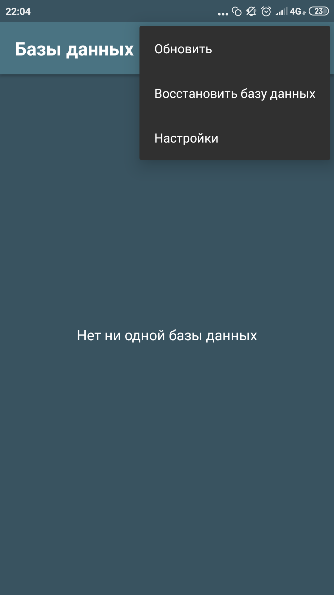
   
1. Выбрать `Из другого источника`.

    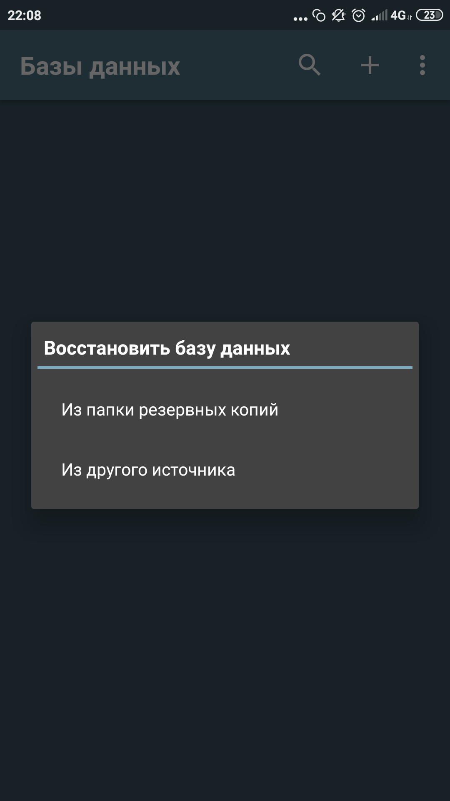

1. Найти и выбрать ранее скачанный файл `zz-schedule-monitor.db`.
1. После этого предложит ввести имя базы, можно ввести любое:

    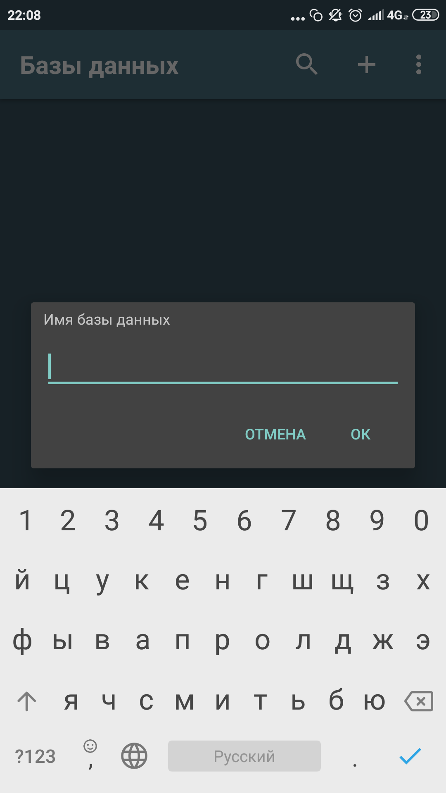

1. Подтвердить восстановление.

    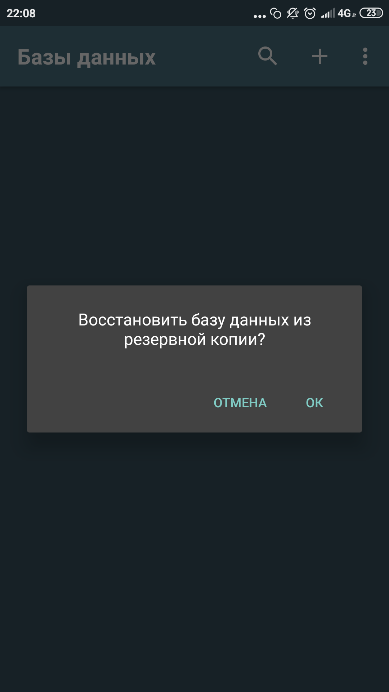

1. Сообщит об успешности восстановления.

    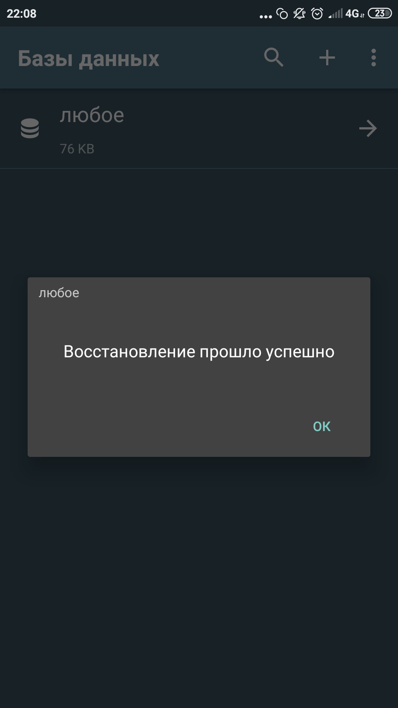

1. Итак, база содержит следующие таблицы.

    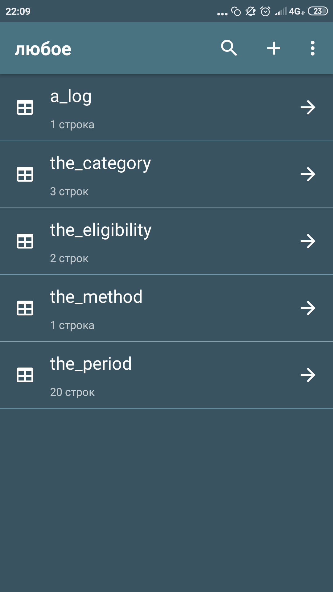
    
    Пройдемся коротко по каждой из пяти таблиц.
    
    Поля с названием `ts` везде означают временной штамп и соответствуют дате и времени создания данной записи.

1. `a_log` — основная таблица, журнал, в котором будет вестись учет.

    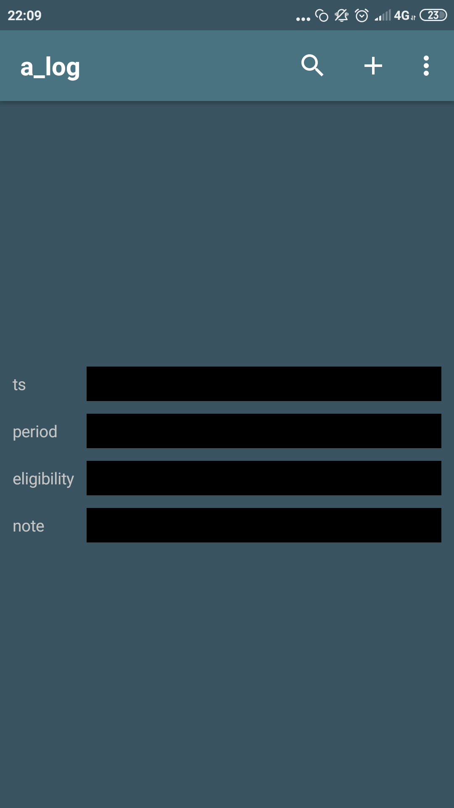

1. `the_category` — список категорий деятельности, фигурирующих в новом режиме, с критериями их определения.

    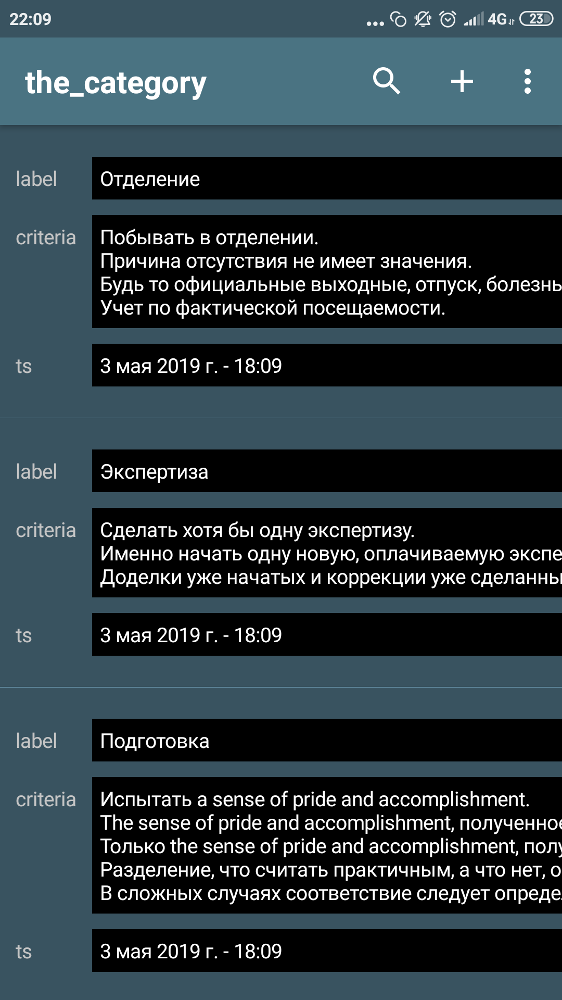

1. `the_eligibility` — таблица со списком вариантов решений, которые можно вынести при мониторинге.

    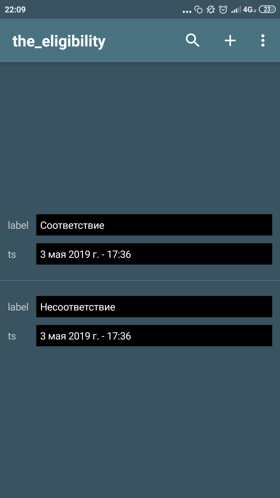

1. `the_method` — главная таблица протокола, содержит основную часть его текста.

    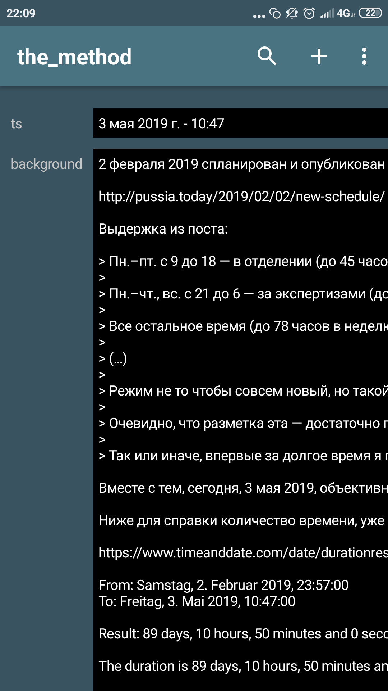

1. `the_period` — список временных интервалов, фигурирующих в новом режиме.

    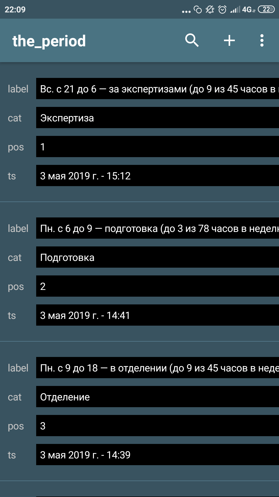
    
1. Обратите внимание, что все изменения, производимые в полях, сохраняются автоматически.

    При необходимости вы можете повторно восстановить оригинальную версию базы, следуя этой же инструкции.
    